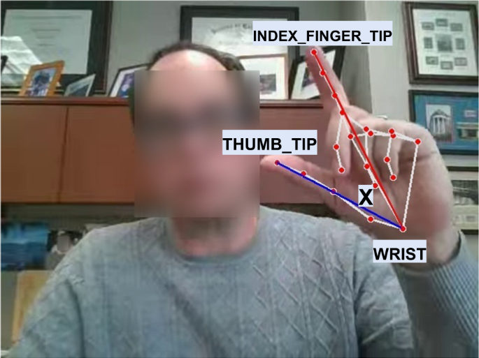

# Parkinson's Disease Detection

Parkinson's disease (PD) is a neurological disorder that can affect a person's movement. One of the symptoms we are interested in is **bradykinesia**, which refers to slowness of movement and can be assessed through repetitive movements such as finger tapping.

A lot of existing research uses computer vision or machine learning to detect Parkinson's from movement data. However, many approaches ultimately try to answer a pretty simple question: **Does this person have Parkinson's or not?**

That's not quite what we're interested in.

Instead, we want to explore whether a computer vision system can **measure Parkinson's-related motor symptoms from video while also communicating how uncertain it is about its assessment.** Basically, we're asking whether we can build a model that doesn't just give an answer, but also tells us how much we should trust that answer?

This gives us two sides to the project:
- **Technical**: Build and evaluate a computer vision model for assessing motor symptoms from finger-tapping video.
- **Research/ethics**: Investigate what it actually means to use a system like this in a clinical setting, including uncertainty, bias, explainability, and when the system should defer to a clinician.

## Why finger tapping?

Finger tapping is a simple and repeatable movement that can reveal differences in motor function.

Things we can potentially measure include:

- Tapping speed
- Movement amplitude
- Movement consistency
- Changes over time
- Differences between hands

We can use these movement patterns as inputs to our model.

## Why are we doing this?
Medical AI can produce impressive predictions, but a prediction by itself does not tell us whether the system should be trusted.

A model might perform well on the data it was trained on but behave differently when:

- The lighting changes
- The camera is positioned differently
- A hand is partially obstructed
- The video quality is lower
- The person looks different from the training population

Uncertainty is particularly important for our project. If a model is highly uncertain about a particular assessment, that could be a situation where the system should defer to a clinician rather than provide a confident-looking answer.

## What is the final result?
By the end of the project, we're aiming for:

- A computer vision pipeline for analyzing finger-tapping videos
- A model for motor symptom assessment
- An uncertainty estimation method
- Experiments evaluating model performance and uncertainty
- An analysis of explainability and potential bias
- A research paper documenting our findings

## Previous research
Before getting started, take a look at the research in [related_works.md](./related_works.md)
